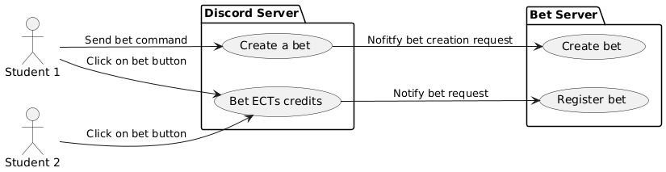
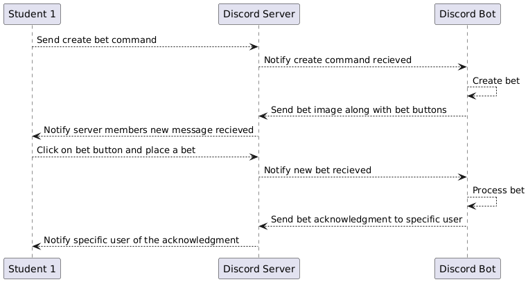
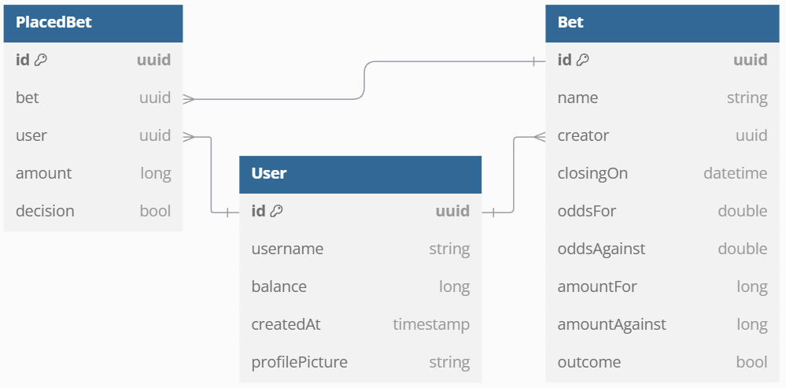

# Initial Report

This report describes the initial specifications of the application.

Its goal is to provide an overview of the initial vision and plan for this project as well as a more detailed view of the features that may be implemented.

## Purpose

The goal of this application is to provide a betting platform integrated into a Discord server. The platform will allow users to place bets using a representation of ECTS credits, view leaderboards, and see ongoing bets.

## Business Domain

The application will be designed for students so they can engage in friendly betting using their ECTS credits. This gamified approach aims to increase student engagement and provide a fun way to interact with their academic credits. 

The bets will be purely fictional and do not involve real ECTS credits.

## User Stories

1. As a student, I want to place bets on various events so that I can earn more ECTS credits.
2. As a student, I want to view the leaderboard so that I can see my ranking compared to others.
3. As a student, I want to see ongoing bets and the amounts bet on each so that I can decide where to place my bets.
4. As an admin, I want to manage the bets and events so that the platform remains fair and engaging.
5. As an admin, I want to generate reports on betting activities so that I can analyze user engagement.

## New Technology

The project will leverage Discord4J, a reactive library for building Discord bots in Java. It enables command handling, real-time updates, and interactive components like buttons and dropdowns, allowing users to place bets, view leaderboards, and interact seamlessly within Discord. Additionally, it will be integrated with PostgreSQL for data storage and an image generator for visually appealing betting displays.

## Features

- **Web Interface**: A web interface for viewing the leaderboard and the bets, ongoing and closed.
- **Discord Integration**: A Discord bot for placing bets and displaying results.
- **Database**: A PostgreSQL database to store bets and user data.
- **Messaging**: JMS (Java Message Service)/Quarkus Messaging for communication between the bot and the web application.
- **Image Generation**: An image generator for displaying the results in Discord.

## Diagrams

### Interactions Diagram

[//]: # (Edit Link : //www.plantuml.com/plantuml/png/ZO-nJiGm38RtF8ML_GOOEw23mih0yGAvn2tMjGau3X92l3lkHP2AIkZ6ED__V_O-YsCfysGc70Ga0TFu8X28qGkbQCohyoSt8jXxoZvnW0FoExA5JmCbetTP_tf69mWEZYWMRZFKmHtA2j8NFFJF6JnZ8CbdK8TzVPgl9blOVqHRJMLNu1EEb0Nv5_qPD5XzfZj82HW5hZhOxMvQ8NJgZs69Wq_px6BOm6rtfVk9_0bIF2UEHIJ55hY-C62QN_c_vsd8FgQ1PFYeUotVf0sCRmMpMDC4ItvxSsqGgWKjP_PwQvcdRm00)

The bet service interface will be implemented in Discord. Discord allows us to create bots that can interact in various ways and allow us to implement commands that users can then send to the server.

The bots are also able to send messages and supply interaction means such as buttons, dropdown lists, etc. These allow us to create a more interactive experience for the users.

In our case we decided to show each bet in an image format with buttons that allow the user to place a bet either for or against the described outcome. This is will be done by sending a message containing an image and the necessary buttons to the Discord channel.

[//]: # (Edit Link : //www.plantuml.com/plantuml/png/dPB1QiCm44Jl_eh1znnwpQ64fkTIo1SeqjWHiRH1kuxftnU59XWJIjthChDw-z1EpHKRqz2q1ni3i-6bnMRpYlOzgfSIS62vihJOui0Su0kT4KSQlAJaScWMqKN_JQoMFyHYz_LJlrTHw2El3Cqy_dp1_l7m8lmRRSMCoVM46oJtcAATRiFZQ2PPdxFFNMnnHzTR0edfoAB8d92eMfS_plYBnlqG_HcIPnoeBYw3yuIhupLAAqZjh77vMSHJzHyodJzdcGQ6FjKhJQ0N-jX5Zr5PLlcS5o4TxCJ5_gRPCOVwFRy1)

When a command leads to an error or the given input is invalid, the bot will respond with an error message. This message will contain information about the error and how to fix it. These messages are designed so the user understands what was wrong (e.g. A bet with name already exists.).

Discord bots can send messages to users in a private chat or as a notification in the same channel that only user that sent the command can see.

This technique can also be used for acknowledging the user input by notifying that the command was received and processed successfully.

### Architecture Diagram

### Data Model

The data model includes entities such as Users, Bets, Events, and Leaderboards. The relationships between these entities will be defined to ensure data integrity and efficient querying.

The following relational data model will be used to shape and implement the entities interactions.

