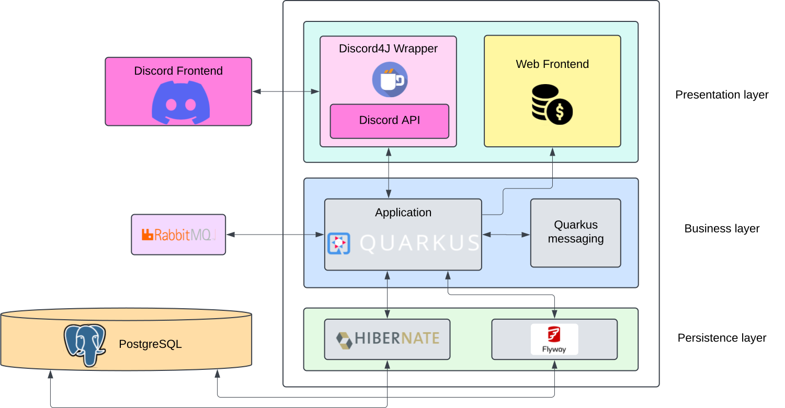

<style>

:root {
  background-size: cover;
}

.center {
  display: flex;
  flex-direction: column;
  align-items: center;
}

.center img {
  margin-top: -35px;
  margin-left: 20px;
  margin-right: 40px;
}
.full-center {
  display: flex;
  flex-direction: column;
  align-items: middle;
  justify-content: center;
  width: 100%;
}

.smol {
  font-size: 0.25rem;
  overflow-wrap: break-word;
  white-space:pre-wrap;
  word-wrap:break-word;
}

@font-face {
    font-family: "Forrest";
    src: url(https://scraps.s3-website.fr-par.scw.cloud/forrest/forrest-regular-webfont.woff2) format('woff2');
    font-weight: 400;
    font-style: normal;
}

@font-face {
    font-family: "Forrest";
    src: url(https://scraps.s3-website.fr-par.scw.cloud/forrest/forrest-light-webfont.woff2) format('woff2');
    font-weight: 300;
    font-style: normal;
}

@font-face {
    font-family: "Forrest";
    src: url(https://scraps.s3-website.fr-par.scw.cloud/forrest/forrest-bold-webfont.woff2) format('woff2');
    font-weight: 700;
    font-style: normal;
}

@font-face {
    font-family: "Forrest";
    src: url(https://scraps.s3-website.fr-par.scw.cloud/forrest/forrest-heavy-webfont.woff2) format('woff2');
    font-weight: 900;
    font-style: normal;
}

h1 {
  font-family: "Forrest";
  font-size: 4rem;
  color: black;
}

h2 {
  font-family: "Forrest";
  font-size: 2rem;
  color: black;
}

h5 {
  color: #777777;
  font-size: 0.75rem;
  margin-top: 0.05rem;
  padding-top: 0;
}

p {
  color: black;
}
</style>

<div class="center">
  
  <h1>eECTS</h1>

  <div style="display:flex;flex-direction:row;gap: 0.25rem;justify-content:space-between;margin-top:2rem;width:100%;">
  <span>Calum Quinn</span>
  <span>Valentin Ricard</span>
  <span>Arthur Ménétrey</span>
  <span>Lionel Pollien</span>
</div>
</div>


---

## Idea

~~Create a healthy outlet while taking courses~~

Gain internet points (and the fame that goes with them) for winning bets in a small scale school community

---

## The bot

- **Someone creates a bet**
- **A new bet is created in the specific channel**

---


---

## The bot

- Someone creates a bet
- A new bet is created in the new channel
- **Players bet on an outcome**

---

# ⌚🛬

---

## The bot

- Someone creates a bet
- A new bet is created in the new channel
- Players bet on an outcome
- **The creator of the bet confirms the outcome**

--- 


## The bot

- Someone creates a bet
- A new bet is created in the new channel
- Players bet on an outcome
- The creator of the bet confirms the outcome
- **And may the odds be ever in your favor**


--- 

## Architecture

<div class="full-center">
    
</div>

---

# _New Technology_

## Discord API

---

## Quarkus Discord4J

Quarkus extension provided in the community repositories (quarkiverse), that wraps some of the base constructs of the discord API with quarkus annotation and IoC.

#### Problem

_Too much_ magic. Some things did not work (like registering multiple commands), and the documentation is really lacking. Because of the use of reactive programming, debugging the issues was nearly impossible.
    
#### Chosen solution:

Move back to interfacing with the raw Discord4J API, and replicate some of the good ideas in our codebase (without all the build-time ✨*magic*✨).

---

### Discord API using Discord4J

### Pros

- A lot more control, required for the Discord API (command registering)
- Possibility to create our own abstrations, designed for our system

### Cons

- A lot of boilerplate code
- Some rough edges and refactors needed to keep the codebase clean (no opinions in the library)

---

## Problems with Reactor's `Mono`
Take a function that returns a `Mono<T>`...

```java
public Mono<String> getOurProjectGrade() {

  return Mono.create((callback) -> {
      //Doing things that takes time...
      callback.success(6.0d);
  });
}
```
✅ Works perfectly

---

... But the instant that we add the `@Transactional` annotation...
##### Especially in our case, we need to have transactions, especially if we are talking about internet points (see reddit)

```java
@Transactional
public Mono<String> getOurProjectGrade() {

  return Mono.create((callback) -> {
      //Doing things that takes time...
      callback.success(6.0d);
  });
}
```

---

Things explode 💥
<pre class="smol">
2025-01-23 23:52:24,031 WARN  [dis.cor.eve.EventDispatcher] (d4j-events-1) [S:0] Error while handling SelectMenuInteractionEventr/registry/index.js:724:7

Exception in Bot.java:102
           100  
           101          // Register event handlers for all commands
        -> 102          gateway.on(SelectMenuInteractionEvent.class, selectMenuEvent -> closureCommand.handleBetSelection(selectMenuEvent)).subscribe();
           103  
           104          // Handle button interactions

: java.lang.ClassCastException: class mutiny.zero.flow.adapters.tors.PublisherAdapterFromFlow cannot be cast to class reactor.core.publisher.Mono (mutiny.zero.flow.adapters.tors.PublisherAdapterFromFlow and reactor.core.publisher.Mono are in unnamed module of loader io.quarkus.bootstrap.classloading.QuarkusClassLoader @202b0582)
        at ch.heigvd.amt.commands.ClosureCommand_Subclass.handleBetSelection(Unknown Source)
        at ch.heigvd.amt.commands.ClosureCommand_ClientProxy.handleBetSelection(Unknown Source)
        at ch.heigvd.amt.discord.Bot.lambda$start$2(Bot.java:102)
        at discord4j.core.event.EventDispatcher.lambda$on$1(EventDispatcher.java:125)
        at reactor.core.publisher.FluxDefer.subscribe(FluxDefer.java:46)
        at reactor.core.publisher.Flux.subscribe(Flux.java:8469)
        at reactor.core.publisher.FluxFlatMap$FlatMapMain.onNext(FluxFlatMap.java:426)
        at reactor.core.publisher.FluxDoFinally$DoFinallySubscriber.onNext(FluxDoFinally.java:130)
        at reactor.core.publisher.FluxPeekFuseable$PeekFuseableSubscriber.onNext(FluxPeekFuseable.java:210)
        at reactor.core.publisher.FluxHandleFuseable$HandleFuseableSubscriber.tryOnNext(FluxHandleFuseable.java:132)
        at reactor.core.publisher.FluxMapFuseable$MapFuseableConditionalSubscriber.tryOnNext(FluxMapFuseable.java:317)
        at reactor.core.publisher.FluxFilterFuseable$FilterFuseableConditionalSubscriber.tryOnNext(FluxFilterFuseable.java:367)
        at reactor.core.publisher.FluxPublishOn$PublishOnConditionalSubscriber.runAsync(FluxPublishOn.java:992)
        at reactor.core.publisher.FluxPublishOn$PublishOnConditionalSubscriber.run(FluxPublishOn.java:1067)
        at reactor.scheduler.forkjoin.ForkJoinPoolScheduler$DisposableWorkerTask.run(ForkJoinPoolScheduler.java:443)
        at reactor.scheduler.forkjoin.ForkJoinPoolScheduler$Worker.processTaskQueue(ForkJoinPoolScheduler.java:407)
        at java.base/java.util.concurrent.ForkJoinTask$RunnableExecuteAction.compute(ForkJoinTask.java:1726)
        at java.base/java.util.concurrent.ForkJoinTask$RunnableExecuteAction.compute(ForkJoinTask.java:1717)
        at java.base/java.util.concurrent.ForkJoinTask$InterruptibleTask.exec(ForkJoinTask.java:1641)
        at java.base/java.util.concurrent.ForkJoinTask.doExec(ForkJoinTask.java:507)
        at java.base/java.util.concurrent.ForkJoinPool$WorkQueue.topLevelExec(ForkJoinPool.java:1460)
        at java.base/java.util.concurrent.ForkJoinPool.runWorker(ForkJoinPool.java:2036)
        at java.base/java.util.concurrent.ForkJoinWorkerThread.run(ForkJoinWorkerThread.java:189)
</pre>

---

The only fix found was to return a `Publisher<T>` instead.
```java
@Transactional
public Publisher<String> getOurProjectGrade() {

  return Mono.create((callback) -> {
      //Doing things that take time...
      callback.success(6.0d);
  });
}
```
✅ Works perfectly

---

## Messaging

Generating images:
- Takes time
- Takes a lot of system resources

##### (An entire browser is started to generate images)

To avoid blocking the user when betting (possibly reaching discord's timeout), we create a queue for image generation.

The best way is to use an event-driven architecture to scale out the image generation process (or throttle it).

We could use JMS, or we could use...

---

## Quarkus messaging
##### (Unofficially) the Modern Replacement™️ to JMS.

Quarkus Messaging (based on SmallRye Reactive Messaging) is a Quarkus extension offering event-driven, data streaming, and event-sourcing applications using CDI.


---

## RabbitMQ

In addition to using annotation and IoC (like what we were using with Discord), we are also able to use modern queues, that don't necessarily support the JMS standard, like **RabbitMQ**.

> RabbitMQ is a reliable and mature messaging and streaming broker, which is easy to deploy in cloud environments, on-premises, and on your local machine. It is currently used by millions worldwide.
- [RabbitMQ promotional website](https://www.rabbitmq.com/)

As it uses the cross-language **AQMP** standard, it can interoperate with many other languages easily.

---

## Let's apply it


---

## Potential improvements
- Add a queue for success messages (to avoid rate limits)
- Add authentication to the panel, to make it easier to do some actions in a centralized manner
- Enrich the embeds with more information
- Show an example deployment with Kubernetes (closing the CI/CD loop)

---

# Questions?